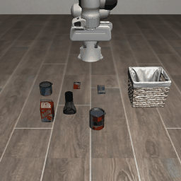
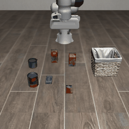
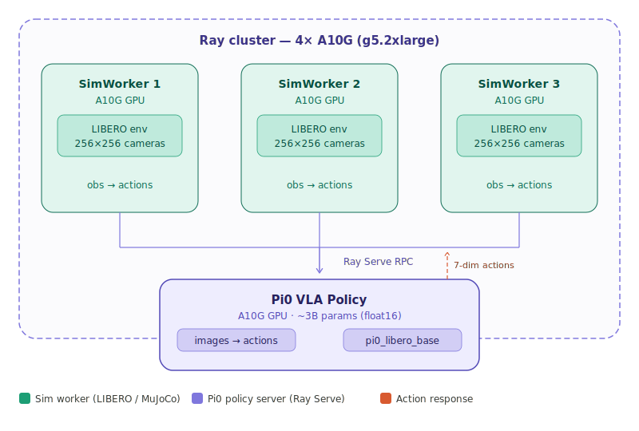

# Scenario 2: Pi0 VLA + LIBERO via Ray Serve

A **3.5-billion-parameter** Vision-Language-Action model ([pi0](https://huggingface.co/lerobot/pi0_libero_base)) served through Ray Serve, controlling a Franka robot arm in [LIBERO](https://libero-project.github.io/) tabletop manipulation tasks.

## Demo

Pi0 controlling Franka arms in LIBERO — real VLA inference via Ray Serve:

| Pick up alphabet soup | Pick up cream cheese | Pick up salad dressing |
|:---:|:---:|:---:|
|  |  |  |

**Sim test** (random actions, verifying LIBERO works):


## What This Shows

Modern robot policies like pi0 are **too large to co-locate with simulation** on the same GPU. This demo decouples them using Ray Serve:



The code change on the sim side is one line:
```python
# Before (co-located):  actions = policy(obs)
# After (Ray Serve):    actions = policy_handle.predict.remote(obs).result()
```

## Results

```
Policy:          lerobot/pi0_libero_base (3.50B params, float16)
Sim workers:     2 × LIBERO on A10G
Avg policy lat:  57ms per inference call
Total calls:     100
Demo time:       14.9s
```

## Quick Start

```bash
# 0. Clone
git clone https://github.com/alicia-yay/libero-pi0-ray-serve.git
cd libero-pi0-ray-serve

# 1. Set HuggingFace token
export HF_TOKEN=hf_your_token_here

# 2. Patch all worker nodes
python patch_workers.py
python set_token.py

# 3. Test sim (random actions, saves GIF)
python test_libero.py

# 4. Test pipeline with placeholder (no model download)
python run_demo.py --placeholder --num-workers 3

# 5. Full demo with Pi0 VLA (~6 GB download, 2 min to load)
python run_demo.py --num-workers 2 --episodes 1 --max-steps 50
```

## Prerequisites

1. **Anyscale workspace** with `libero-pi0-ray-serve` container image
2. **HuggingFace token** → [create here](https://huggingface.co/settings/tokens)
3. **Accept PaliGemma license** → [click Agree](https://huggingface.co/google/paligemma-3b-pt-224)

## Cluster Configuration

| Role | Instance | RAM | GPU | Count |
|------|----------|-----|-----|-------|
| Head node | m5.2xlarge | 32 GB | — | 1 |
| GPU workers | g5.2xlarge | 32 GB | A10G 24GB | 4 |

> **Why g5.2xlarge?** Pi0 float16 is ~6 GB weights, but `from_pretrained` peaks at ~2× in system RAM. g5.xlarge (16 GB) OOMs; g5.2xlarge (32 GB) loads cleanly.

## Files

| File | Purpose |
|------|---------|
| `policy_server.py` | Pi0 via Ray Serve + Gemma attention+  PlaceholderPolicyServer |
| `sim_worker.py` | Ray remote actor: LIBERO sim → cameras → policy RPC → actions → GIFs |
| `run_demo.py` | Orchestrator: deploy policy → launch workers → run episodes → save results |
| `test_libero.py` | Smoke test: one worker, random actions, 50 steps, saves GIF |
| `patch_workers.py` | Fix groot, transformers check, PaliGemma API on all workers |
| `set_token.py` | Write HF token to all worker nodes |
| `libero_env.py` | LIBERO env wrapper (headless, monkey-patched input, BDDL paths) |
| `setup.sh` | Alternative setup: patches + dep verification |
| `Containerfile` | Docker image definition |

## Known Issues & Fixes

| Issue | Fix |
|-------|-----|
| Gemma causal mask size mismatch (918 vs 867) | Monkey-patch `eager_attention_forward` in `policy_server.py` |
| `groot` dataclass crash (Python 3.11) | `patch_workers.py` deletes groot dir |
| PaliGemma `.model` attribute missing | `patch_workers.py` patches `modeling_pi0.py` |
| Transformers version check fails | `patch_workers.py` bypasses the check |
| LIBERO `input()` hangs in Ray | `builtins.input = lambda: "n"` + LIBERO config file |
| OOM on g5.xlarge | Use g5.2xlarge + `dtype=torch.float16` |
| Ray Serve `DeploymentResponse` | `.result()` instead of `ray.get()` |
| Anyscale `pip install` registers cluster deps | Install on workers only via `ray.remote`, never on head node |

## Comparison with Scenario 1

| | Scenario 1 (Isaac Lab + Ray Core) | Scenario 2 (LIBERO + Pi0 + Ray Serve) |
|---|---|---|
| Sim | Isaac Lab (GPU-accelerated) | LIBERO / robosuite (MuJoCo) |
| Policy | MLP (~200K params) | Pi0 VLA (~3.5B params) |
| Co-located? | Yes, same GPU | No, separate GPUs |
| Serving | Direct function call | Ray Serve deployment |
| Use case | Robustness sweep | VLA deployment pattern |

## License

Apache 2.0
